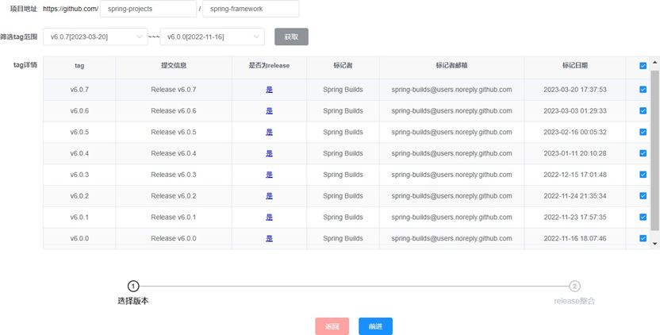

## README：
### 一、准备工作：
1.环境
JDK >= 1.8 (推荐1.8版本)
Mysql >= 5.7.0 (推荐5.7版本)，高版本需要[修改mysql配置](https://blog.csdn.net/Ginny97/article/details/116862568#:~:text=%E8%A7%A3%E5%86%B3%E6%96%B9%E6%B3%95%EF%BC%9A%20--,%E5%8E%BB%E9%99%A4%20ONLY_FULL_GROUP_BY%E6%A8%A1%E5%BC%8F%EF%BC%8C%E9%87%8D%E6%96%B0%E8%AE%BE%E7%BD%AE%E5%80%BC%E3%80%82)
Redis >= 3.0
Maven >= 3.0
Node >= 12
2.配置更改
（1）修改数据库连接：编辑khonsu-admin/src/main/resources目录下的application-druid.yml——spring.datasource.druid.master.url/username/password,修改为本机密码
（2）修改服务器配置：编辑khonsu-admin/src/main/resources目录下的application.yml——server.port/servlet（不修改也可使用项目）

（3）修改tmp文件路径：编辑khonsu-admin/src/main/resources目录下的application.yml中的path，改为本机项目中tmp文件夹的绝对路径。

**说明**：**E:\NJU项目\Khonsu\tmp**——所有过程数据和结果数据的存放文件夹（只需要改这个，子文件夹其他都是相对路径）
  \java：下载的GitHub源码
    \release：切分完的release notes
  \code：分割好的代码块（展示用）
    \code_block：去除部分干扰数据（如包名、注释等）的分割代码块（计算用）
    \invalid：跨版本的代码块（理论上不存在，如果出现说明中间版本的文件解析错误，需要排查）
  \repo：ecco磁盘数据库（不用管）
    \result：结果数据
        \class：原本是将.java改为.text，现在不需要了，但没删掉，等于\code_block中的数据
        \class_preprocessed：预处理后的代码块
        \uc_preprocessed：预处理后的release notes

### 二、运行系统
后端：
1.加载Maven依赖包
2.创建khonsu数据库并导入sql文件夹下的khonsu.sql脚本
3.打开Redis
4.运行cn.edu.nju.KhonsuApplication.java（出现启动成功）
前端：
1.命令行键入

```
# 进入项目目录
cd khonsu-ui

# 安装依赖
npm install

# 换源（仅供参考）
npm install --registry=https://registry.npmmirror.com

# 本地开发 启动项目
npm run dev
```

2.打开http://localhost:5099 账号/密码：admin/admin123


### 三、使用案例

我们使用 Spring Framework进行此次案例分析。它是当前 Java 生态圈中最具代表的开源框架之一.

 

​                                     图 1: 新建 spring-framework 项目操作页面 

Spring Framework 有着非常活跃的开源社区，并在 GitHub 上维护着较好的 release notes。考虑到大版本跨度间势必存在着一些隐式的代码提交，因此这里我们选用 v6.0.0 到目前最新的 v6.0.7 进行分析。

  

​                                      图 2: 新建 spring-framework 项目操作页面 2

 

  图1和2为新建项目时的页面。输入 Spring Framework 的所有者和仓库名，在版本号列表加载完后选择 v6.0.7-v6.0.0，获取它们的版本详细信息（可能较慢需要等待一会），确认每个版本都有 release notes 后全部选中点击前进进入下一步。待系统自动生成 release notes 综合文本后，因 Spring Framewrok 的 release notes 编写规范无须修改，直接点击提交新建项目并等待项目分析完成。

  

​                                       图 3: spring-framework 分析详情页面

​		项目分析完成后跳转至分析详情页， 如图3所示。该页面展示的是 release note 与对应代码块的关联关系，可以对 release notes 相关的代码提交进行补充判断，关联越准确，检索隐式提交也越准确。此处只参考相似度不进行任何操作，直接点击隐式提交进入 v6.0.7 版本的隐式提交检索页。

 

​                                           图 4: spring-framework 隐式提交检索页面

​		为了方便，打开删除和测试开关只查看新增代码块。依次排查表格中的代码块，如图4所示。忽略注释层面的变化，找到一个像图4中的 Gener-icMessage.java 一样在非注释层面变化的代码块。可以看到该代码修改了 toString() 方法，为了确认其具体修改原因，点击参考按钮，跳转到历史提交列表页面，如图6 5所示。该页可以看到 v6.0.7 版本涉及 GenericMessage.java 修改的全部提交。

 

​                                       图 5: GenericMessage.java 历史提交列表页面


​	以历史提交列表页为起点依次排查其本版本的代码提交，并选择查看其相关的 issue 或 pr。图6 6为包含 GenericMessage.java 变化的代码提交，可以看到提交信息为把“instanceof pattern matching”应用于 spring-messaging 模块的其余部分，并关联了对应的 issue。到这里为止，找到了 GenericMessage.java 变化的原因，在探究变化前，先验证一下 v6.0.7 的 release notes 是否描述了这一变化。

  

​                                         图 6: GenericMessage.java 代码提交页面


​		v6.0.7 的 release notes 如图6 7所示（只截取了部分），其中并未说明“in-stanceof pattern matching”相关的变化，验证了可以有效地通过本系统找到隐式的代码提交。

  

​                                  图 6 7: spring-framework/v6.0.7 的 release notes

​		提交信息中提到的“instanceof pattern matching”是 Java 14 引入的新特性，它可以让开发者在对实例进行类型检查的同时，将实例的类型绑定到一个变量上，从而避免进行显式类型转换，规避显式类型转换带来精度丢失、可能出现运行时异常等问题。这项特性的主要意义在于运行时只会进行一次类型检查，不需要进行多次类型转换和判断，避免了大量的类型转换和 if-else 语句的使用，可以有效地降低代码的执行时间和内存占用，也减少了代码中的错误和潜在的运行时异常，提高代码的可读性和可维护性。该特性应该被应用在所有涉及泛型判断的类中，并作为一种规范指导后续的开发。

​		Release notes 中缺失该提交的变化描述会带来许多问题。对于普通阅读源码的用户来说，如果没有接触过 Java14，可能会对这段新特性代码感到疑惑。对于开发团队中的非核心开发人员（不参与 release notes 制作，和用户一样通过 release notes 来了解新版本变化）来说，在对涉及泛型判断的类进行编码时，不了解“instanceof pattern matching”引入可能会导致他们继续沿用之前开发习惯，通过显式类型转换来进行泛型类的判断，这将导致整个项目内部编码细节不一致，增加后续润色代码的工作量。因此，在 release notes 中提及引入新特性变化是必要的。

​		如图8所示，spring-framework 开发团队其实从进入 6.0 版本以来一直在做“instanceof pattern matching”的应用。在 Spring Framework 要求的 Java 版本


​                                        图 8: instanceof pattern matching 相关提交

​		升级到 JDK17 后，引入新特性固然是一种良好的编码实践，但这种特性应用的代码重构往往涉及许多分散在各个模块中的代码文件，修改量很大，应当被详细记录在 release notes 中，方便后续问题跟踪和制定开发规范。